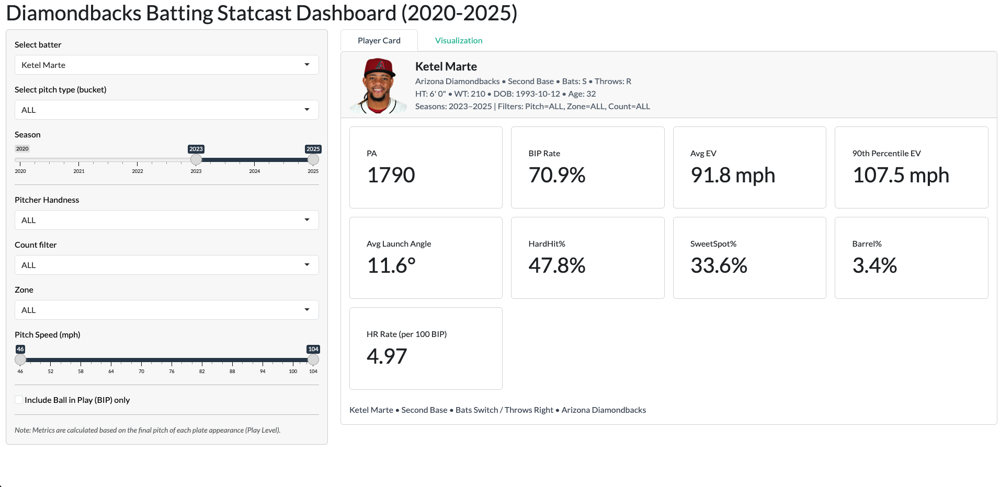

# Baseball Analytics Study Projects

This directory contains a sequence of baseball analytics projects,
organized to reflect increasing modeling and system complexity.

## 00. Catcher Framing Analysis (Statcast)
- Objective: Quantify a catcher’s ability to convert pitches into called strikes
- Method: lightGBM probability model, Bayesian hierarchical model
- Focus: Context adjustment, hierarchical shrinkage, and run-value interpretation

## 01. Bayesian Hierarchical Swing Model
- Objective: Estimate player-level swing probabilities
- Method: Bayesian hierarchical model with partial pooling
- Focus: Shrinkage, uncertainty, small-sample stability

## 02. Carroll vs Marte Statcast Analysis
- Objective: Compare power profiles using Statcast data
- Methods: Density analysis and pitch-location mapping
- Focus: Launch speed, launch angle, and damage zones

## 03. Statcast Batting Dashboard (R Shiny)

🔗 **Live App**: https://bowenlizh.shinyapps.io/dbacks-batting/

- Objective: Build an interactive hitter analysis tool
- Focus: Decision, Contact, and Damage decomposition
- Output: Deployed R Shiny application
